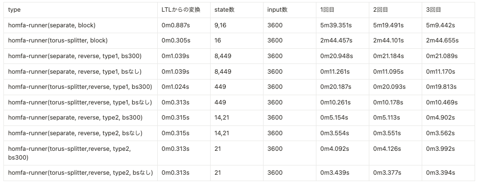

# homfa-runner-experiments

## 概要

`homfa-runner-experiments` は、[homfa-runner](https://github.com/ys7i/homfa-runner) リポジトリのソフトウェアのベンチマークを実行し、その結果を分析するための実験用ツールです。このツールは、`homfa-runner` を実行し、そのパフォーマンスを評価するために設計されています。`homfa-runner`はLTLを仕様として準同型暗号を用いたモニタリングを行うソフトウェアです。

## 前提条件

- homfa-runner ソフトウェアがインストールされていること
- Unix系のシェル環境（Bashなど）

## インストール
- homfa-runner-experimentsのインストール
```bash
git clone git@github.com:ys7i/homfa-runner-experiments.git
```

- homfa-runnerのインストール
```bash
git clone git@github.com:ys7i/homfa-runner.git
```

## ベンチマークの実行方法
> homfa-runner-experimentsは2つのスクリプト(benchmark.shとoutput_spreadsheet_data.sh)とベンチマークの実行結果で構成されています。
### resultディレクトリ
benchmark.shによってベンチマークの実行結果が格納されます。各LTL名で内部にディレクトリが生成され、その内部に実行日時, LTL名, モニタリングの入力ファイル名を連結したファイル名でベンチマークの実行結果が保存されます。  

## benchmark.sh
> ベンチマークを実行するShell Scriptです。
- 実行前にスクリプト内の`HOMFA_RUNNER_DIR`を`homfa-runner-experiments`から`homfa-runner`への相対パスに書き換えてください。  
実行例
```bash
bash benchmark.sh n14 7 input5600.txt
```
引数は対象LTL名, atomic propositionの数, 入力ファイルの名前です。LTL名は`homfa-runner`の`graph-config`ディレクトリ内にあるLTLのディレクトリ名, 入力ファイルは`homfa-runner`のinput-filesディレクトリ内にあるファイル名です。atomic propositionの数(例では`7`)はLTLが決まると一意に定まります。これがblockアルゴリズムのblock数に相当します。  

benchmark.shが実行されると`bk`や`sk`というファイルが`homfa-runner-experiments`内に生成され、その後`enc_in`というファイルが生成されますが、これらは準同型暗号のkeyファイルやモニタリングの入力ファイルです。これらはgitignoreされています。

## output_spreadsheet_data.sh
- 次の結果の解析を参照してください。

## 結果の解析
`benchmark.sh`を実行すると、benchmarkの結果が出力されます。

**出力例**
```
/usr/bin/bash benchmark.sh n3-g10 2 input2400.txt
1 ../homfa-runner/build/src/main generate-key --input-file ../homfa-runner/input-files/input2400.txt 1
+ eval ../homfa-runner/build/src/main generate-key --input-file ../homfa-runner/input-files/input2400.txt
++ ../homfa-runner/build/src/main generate-key --input-file ../homfa-runner/input-files/input2400.txt
2400
+ set +x


separate block
3 time ../homfa-runner/build/src/main separate --type=block --top-file ../homfa-runner/graph-config/two-dfa/n3-g10/forward-top.spec --bottom-file ../homfa-runner/graph-config/two-dfa/n3-g10/forward-bottom.spec -p --block-size 2 1
+ eval time ../homfa-runner/build/src/main separate --type=block --top-file ../homfa-runner/graph-config/two-dfa/n3-g10/forward-top.spec --bottom-file ../homfa-runner/graph-config/two-dfa/n3-g10/forward-bottom.spec -p --block-size 2
++ ../homfa-runner/build/src/main separate --type=block --top-file ../homfa-runner/graph-config/two-dfa/n3-g10/forward-top.spec --bottom-file ../homfa-runner/graph-config/two-dfa/n3-g10/forward-bottom.spec -p --block-size 2
[2023-11-15 16:29:03.413] [info] bottom

real	7m55.757s
user	13m24.928s
sys	0m30.413s
+ set +x


3 time ../homfa-runner/build/src/main separate --type=block --top-file ../homfa-runner/graph-config/two-dfa/n3-g10/forward-top.spec --bottom-file ../homfa-runner/graph-config/two-dfa/n3-g10/forward-bottom.spec -p --block-size 2 2
+ eval time ../homfa-runner/build/src/main separate --type=block --top-file ../homfa-runner/graph-config/two-dfa/n3-g10/forward-top.spec --bottom-file ../homfa-runner/graph-config/two-dfa/n3-g10/forward-bottom.spec -p --block-size 2
++ ../homfa-runner/build/src/main separate --type=block --top-file ../homfa-runner/graph-config/two-dfa/n3-g10/forward-top.spec --bottom-file ../homfa-runner/graph-config/two-dfa/n3-g10/forward-bottom.spec -p --block-size 2
[2023-11-15 16:37:00.826] [info] bottom

real	7m57.432s
user	13m36.855s
sys	0m29.338s
+ set +x


3 time ../homfa-runner/build/src/main separate --type=block --top-file ../homfa-runner/graph-config/two-dfa/n3-g10/forward-top.spec --bottom-file ../homfa-runner/graph-config/two-dfa/n3-g10/forward-bottom.spec -p --block-size 2 3
+ eval time ../homfa-runner/build/src/main separate --type=block --top-file ../homfa-runner/graph-config/two-dfa/n3-g10/forward-top.spec --bottom-file ../homfa-runner/graph-config/two-dfa/n3-g10/forward-bottom.spec -p --block-size 2
++ ../homfa-runner/build/src/main separate --type=block --top-file ../homfa-runner/graph-config/two-dfa/n3-g10/forward-top.spec --bottom-file ../homfa-runner/graph-config/two-dfa/n3-g10/forward-bottom.spec -p --block-size 2
[2023-11-15 16:44:32.363] [info] bottom

real	7m31.521s
user	13m12.905s
sys	0m26.250s
+ set +x
```
この結果から実行にかかった時間のみを抽出するのが`output_spreadsheet_data.sh`です。

**実行例**

```bash
bash output_spreadsheet_data.sh result/n14/2023-11-17_n14_7_input5600.txt 
```

**実行結果**
```
5m39.351s       5m19.491s       5m9.442s
2m44.457s       2m44.101s       2m44.655s
0m20.948s       0m21.184s       0m21.089s
0m11.261s       0m11.095s       0m11.170s
0m20.187s       0m20.093s       0m19.813s
0m10.261s       0m10.178s       0m10.469s
0m5.154s        0m5.113s        0m4.902s
0m3.554s        0m3.551s        0m3.562s
0m4.092s        0m4.126s        0m3.992s
0m3.439s        0m3.377s        0m3.394s
```
この結果は以下の表と対応しています。


出力結果はスプレッドシートに貼り付けられるようになっています。私(阪口)はnotionで結果を管理していますが、直接貼ると1つのセルにすべて貼り付けられてしまうので、一度スプレッドシートに貼り付けて再度コピーをした上でnotionに貼り付けるとうまく整形されます。
